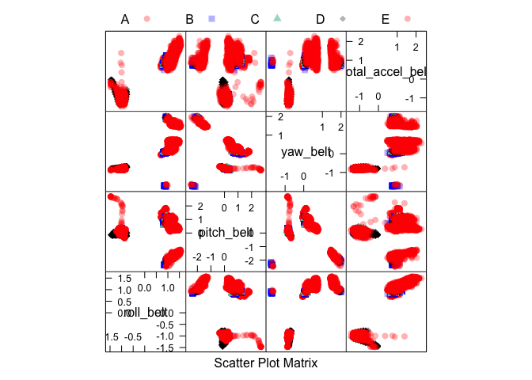
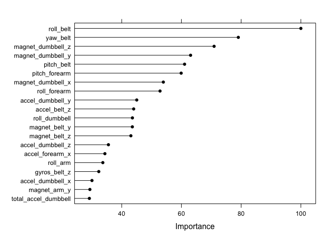

# Smartbells: When Your Dumbbell Outsmarts Your Personal Trainer
J Faleiro  
May 5, 2016  


# Introduction

People regularly quantify _*how much*_ of a particular activity they do, but they rarely quantify _*how well*_ that same activity is performed. More often than not discerning the quality of a work out requires specialized supervision of a personal trainer.

Have you ever imagined a scenario in which your training equipment would play the role of your personal trainer?

This is actually what this whole analysis is all about. We predict how well people exercise based on data produced by accelarators attached to their belt, forearm, arm, and dumbell. 

The overall quality in which people exercise is given by the "classe" variable in the training set. Classe 'A' indicates an exercise perfomed correctly (all kudos to you, athlete). The other classes indicate common exercizing mistakes.

All credits for data collection and original analysis go to the [Human Activity Recognition - HAR](http://groupware.les.inf.puc-rio.br/har) laboratory, previously detailed in [this paper][1]. Credits for educational notes go to the [Johns Hopkins School of Biostatistics](http://www.jhsph.edu/departments/biostatistics/).

# Pre-Processing

For this analysis a number of libraries are required. If you intend to replicate this report make sure you use the same list of dependencies:


```r
pacman::p_load(knitr, caret, e1071, mlbench, ggplot2, ISLR, Hmisc, gridExtra, RANN, 
               AppliedPredictiveModeling, corrplot, randomForest, gbm, splines, parallel,
               plyr, dplyr, leaps, MASS, pROC, C50,
               # parallel support
               doMC)
```

## Obtaining the Data

The first step is downloading the data required for this exercise. The training and check data sets are available respectively at `url` and `urlTesting` locations:


```r
url <- 'https://d396qusza40orc.cloudfront.net/predmachlearn/pml-training.csv'
file <- 'pml-training.csv'
urlTesting <- 'https://d396qusza40orc.cloudfront.net/predmachlearn/pml-testing.csv'
testingFile <- 'pml-testing.csv'
```


```r
download.file(urlTesting, destfile=testingFile, method="curl")
```


```r
download.file(url, destfile=file, method="curl")
```

## Data Clean Up

From initial visual inspection we identified a few issues we will have to address at the time we will read them.

* In some cases empty values are described by constants `NA`, some other times by empty strings and some other times by random strings like "#DIV/0!". The vetor `na.strings` represents all values in the dataset that should be treated as `NA`.
* Most columns are not relevant to this regression exercise. Some examples are the name of the user performing the exercise, timestamp or window number. The columns we are interested in are represented as regular expressions in `grepExpr`.
* This a large dataset. We set a `shrinkage` factor to artificially reduce the dataframe and lower the processing times during iterations of model development. On the final version, shrinkage should be set to `1.0`.


```r
na.strings <- c('','.','NA','#DIV/0!')
grepExpr <- paste(c('.*_dumbbell', '.*_arm', '.*_belt', '.*_forearm', 'classe'), collapse='|')
shrinkage <- 1.0
```

## Raw Feature Selection

We only load columns from testing in `testingRaw` if all these conditions are true:

* At least one value is not `NA`
* A column name must match the regular expression in `na.strings`


```r
testingRaw <- read.csv(testingFile, na.strings=na.strings) 
testingRaw <- testingRaw[, colSums(is.na(testingRaw)) != nrow(testingRaw)] # at least one value != NA
testingRaw <- testingRaw[,grep(grepExpr, names(testingRaw))]
```

We only load a training column from `trainingRaw` if the column is also defined in testing data set and loaded in `testingRaw`:


```r
trainingRaw <- read.csv(file, na.strings=na.strings)
trainingRaw <- trainingRaw[,c(colnames(testingRaw), 'classe')]
if (shrinkage < 1.0) {
    set.seed(123)
    index <- createDataPartition(trainingRaw$classe, p=shrinkage, list=FALSE)
    trainingRaw <- trainingRaw[index,]
}
```

## Data Partitioning

The data is partitioned into a **75/25%** split between training and testing for training, cross-validation and in/out sample testing using the method `createDataPartition` from `caret`:


```r
set.seed(123)
inTraining <- createDataPartition(trainingRaw$classe, p=.75, list=FALSE)
training <- trainingRaw[inTraining,]
dim(training)
```

```
## [1] 14718    53
```

```r
testing <- trainingRaw[-inTraining,]
dim(testing)
```

```
## [1] 4904   53
```

## Data Imputation

We replace `NA` values by the average of K nearest neighbors of that missing value. The K nearest neighbors imputation algorithm is applied only on numerical columns of the training set. We use the `caret` function `preProcess` with `method='knnImpute'`:


```r
numerical <- training[, sapply(training, is.numeric)]
set.seed(123)
pp <- preProcess(numerical, method=c('knnImpute'))
trainingImputed <- predict(pp, numerical)
trainingImputed$classe <- training$classe
```

# Model Fitting

## Feature Selection

We opted to use an explicit feature selection model, random forest, in which feature selection is performed through cross validation.

## Training

We train our model random forests model, `method='rf'`, over 6-folds cross validation (`method='cv'` in `trainControl`) using parallel processsing whenever available:


```r
registerDoMC(6) # parallel support
set.seed(123)
fitForward <- train(classe ~ ., data=trainingImputed, method='rf',
                    trControl=trainControl(method='cv',
                                           number=6, 
                                           allowParallel=TRUE
                                           )
                    )
```

## Feature Importance

Despite of the absence of automatic feature selection, the random forest classification algorithm does keep track of a ranking of how well each feature collaborate to the outcome on each class. We call this ranking `importance`, retrieved through the method `varImp` in `caret`.


```r
importance <- varImp(fitForward)
```

The cross correlation of the top 4 features is given in a feature plot. 


```r
transparentTheme(trans = .3)
featurePlot(x=trainingImputed[,rownames(head(importance$importance,4))],
            y=trainingImputed$classe,
            plot='pairs',
            auto.key=list(columns=5)
            )
```

<!-- -->

We can visually detect a number of clusters for each of the classes A, B, C, D and E, as well as several clear linear relationships - a clear hint that this model should perform well.

Specifically the 15 top features on this model...


```r
head(importance$importance, 15)
```

```
##                     Overall
## roll_belt        100.000000
## pitch_belt        61.054130
## yaw_belt          79.056338
## total_accel_belt  23.793061
## gyros_belt_x       6.927417
## gyros_belt_y       7.151216
## gyros_belt_z      32.320001
## accel_belt_x      10.707923
## accel_belt_y      10.639753
## accel_belt_z      44.004848
## magnet_belt_x     24.084942
## magnet_belt_y     43.564740
## magnet_belt_z     43.070473
## roll_arm          33.679146
## pitch_arm         17.851406
```

...proportionally stacked visually:


```r
plot(importance, top=20)
```

<!-- -->

# Prediction and In/Out Sample Error Measurements

We will measure and track in and out sample error by means of comparison of a confusion matrix against the training partition and a testing partition cented and scaled around metrics of the training partition.


## In-Sample Error

We will use the definition that in-sample error is the diffence between your prediction and actuals for _data points used to build the model_.

We should expect the in-sample error to be 0%, equivalent to 100% accuracy, what indicates the bias of the in-sample error measurement:


```r
isPred <- predict(fitForward, trainingImputed)
```


```r
cm <- confusionMatrix(trainingImputed$classe, isPred)
cm$table
```

```
##           Reference
## Prediction    A    B    C    D    E
##          A 4185    0    0    0    0
##          B    0 2848    0    0    0
##          C    0    0 2567    0    0
##          D    0    0    0 2412    0
##          E    0    0    0    0 2706
```

As expected, no misses. In-sample error matches the theoretical expectation of **0%**.

## Out-Sample Error

For the out-sample errors, since the KNN imputation scales and centers the training data set, we need to center the measurements on the testing set around the mean on the training partition, and scale to the standard deviation of the same training partition This is performed by the function `centerOnReference`.


```r
numericalTesting <- testing[, sapply(testing, is.numeric)]
testingImputed <- centerOnReference(numericalTesting, training)
testingImputed$classe <- testing$classe 
```


```r
osPred <- predict(fitForward, testingImputed)
```


```r
cm <- confusionMatrix(testing$classe, osPred)
cm$table
```

```
##           Reference
## Prediction    A    B    C    D    E
##          A 1394    1    0    0    0
##          B    2  945    2    0    0
##          C    0    8  846    1    0
##          D    0    0   19  783    2
##          E    0    0    0    1  900
```

For this model, for an accuracy of **99.27%** the out-sample error is **0.73%**, with a confidence interval of **98.99%** to **99.49%**. 

The complete confusion matrix is given by:


```
## Confusion Matrix and Statistics
## 
##           Reference
## Prediction    A    B    C    D    E
##          A 1394    1    0    0    0
##          B    2  945    2    0    0
##          C    0    8  846    1    0
##          D    0    0   19  783    2
##          E    0    0    0    1  900
## 
## Overall Statistics
##                                           
##                Accuracy : 0.9927          
##                  95% CI : (0.9899, 0.9949)
##     No Information Rate : 0.2847          
##     P-Value [Acc > NIR] : < 2.2e-16       
##                                           
##                   Kappa : 0.9907          
##  Mcnemar's Test P-Value : NA              
## 
## Statistics by Class:
## 
##                      Class: A Class: B Class: C Class: D Class: E
## Sensitivity            0.9986   0.9906   0.9758   0.9975   0.9978
## Specificity            0.9997   0.9990   0.9978   0.9949   0.9998
## Pos Pred Value         0.9993   0.9958   0.9895   0.9739   0.9989
## Neg Pred Value         0.9994   0.9977   0.9948   0.9995   0.9995
## Prevalence             0.2847   0.1945   0.1768   0.1601   0.1839
## Detection Rate         0.2843   0.1927   0.1725   0.1597   0.1835
## Detection Prevalence   0.2845   0.1935   0.1743   0.1639   0.1837
## Balanced Accuracy      0.9991   0.9948   0.9868   0.9962   0.9988
```


# Final Notes

In a simple and quick fitting we were able to get very close to the weighted average of the [baseline accuracy][1] of **99.4%**. Despite of the numerical proximity of the results, we can see the baseline is on the upper boundary of the confidence interval of this study:


```
## AccuracyUpper 
##         99.49
```

We were limited in terms of computing resources and time (this analysis was performed beginning to end in about 3 hours). If we had more time we could try ensemble methods for classifications, specifically `AdaBoost`, but that would be beyond the intent and time allocated for this exercise.

If you want to check a more elaborate analysis you can either check the [original paper][1] or refer to  a [longer version of this study][3], where we list several techniques and options for investigation over the same raw data.


# References

* [[1]] "Ugulino, W.; Cardador, D.; Vega, K.; Velloso, E.; Milidiu, R.; Fuks, H. Wearable Computing: Accelerometers' Data Classification of Body Postures and Movements. Proceedings of 21st Brazilian Symposium on Artificial Intelligence. Advances in Artificial Intelligence - SBIA 2012. In: Lecture Notes in Computer Science. , pp. 52-61. Curitiba, PR: Springer Berlin / Heidelberg, 2012. ISBN 978-3-642-34458-9. DOI: 10.1007/978-3-642-34459-6_6."
* [[2]] "Implicit Feature Selection Models in Caret"
* [[3]] "Smartbells: When Your Dumbbell Outsmarts Your Personal Trainer"

[1]: http://groupware.les.inf.puc-rio.br/public/papers/2012.Ugulino.WearableComputing.HAR.Classifier.RIBBON.pdf 
[2]: http://topepo.github.io/caret/Implicit_Feature_Selection.html
[3]: http://rpubs.com/jfaleiro/smartbells

**Session Configuration Details** (reproducibility of this analysis)


```r
sessionInfo()
```

```
## R version 3.2.4 (2016-03-10)
## Platform: x86_64-apple-darwin13.4.0 (64-bit)
## Running under: OS X 10.11.4 (El Capitan)
## 
## locale:
## [1] en_US.UTF-8/en_US.UTF-8/en_US.UTF-8/C/en_US.UTF-8/en_US.UTF-8
## 
## attached base packages:
## [1] parallel  splines   stats     graphics  grDevices utils     datasets 
## [8] methods   base     
## 
## other attached packages:
##  [1] doMC_1.3.4                      iterators_1.0.8                
##  [3] foreach_1.4.3                   C50_0.1.0-24                   
##  [5] pROC_1.8                        MASS_7.3-45                    
##  [7] leaps_2.9                       dplyr_0.4.3                    
##  [9] plyr_1.8.3                      gbm_2.1.1                      
## [11] randomForest_4.6-12             corrplot_0.77                  
## [13] AppliedPredictiveModeling_1.1-6 RANN_2.5                       
## [15] gridExtra_2.2.1                 Hmisc_3.17-4                   
## [17] Formula_1.2-1                   survival_2.38-3                
## [19] ISLR_1.0                        mlbench_2.1-1                  
## [21] e1071_1.6-7                     caret_6.0-68                   
## [23] ggplot2_2.1.0                   lattice_0.20-33                
## [25] knitr_1.12.3                    pacman_0.4.1                   
## 
## loaded via a namespace (and not attached):
##  [1] Rcpp_0.12.4         class_7.3-14        assertthat_0.1     
##  [4] digest_0.6.9        R6_2.1.2            chron_2.3-47       
##  [7] acepack_1.3-3.3     MatrixModels_0.4-1  stats4_3.2.4       
## [10] evaluate_0.9        minqa_1.2.4         data.table_1.9.6   
## [13] SparseM_1.7         car_2.1-2           nloptr_1.0.4       
## [16] partykit_1.0-5      rpart_4.1-10        Matrix_1.2-4       
## [19] rmarkdown_0.9.6     lme4_1.1-12         stringr_1.0.0      
## [22] foreign_0.8-66      munsell_0.4.3       mgcv_1.8-12        
## [25] htmltools_0.3.5     nnet_7.3-12         CORElearn_1.47.1   
## [28] codetools_0.2-14    grid_3.2.4          nlme_3.1-125       
## [31] gtable_0.2.0        DBI_0.4             magrittr_1.5       
## [34] formatR_1.3         scales_0.4.0        stringi_1.0-1      
## [37] reshape2_1.4.1      latticeExtra_0.6-28 RColorBrewer_1.1-2 
## [40] tools_3.2.4         pbkrtest_0.4-6      yaml_2.1.13        
## [43] colorspace_1.2-6    cluster_2.0.3       quantreg_5.21
```
